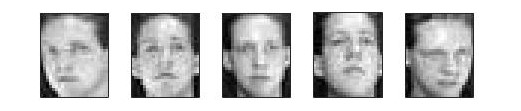
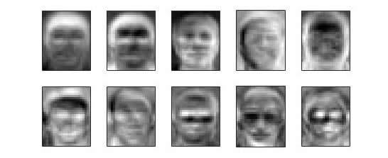

# Facial Image Analysis with PCA and kNN

Discovering known objects in camera images is an important and challenging area of research with applications in medical diagnosis, military surveillance, underwater search and satellite navigation.

We will look at a specific problem of recognizing people from their facial images, assuming there are some images of known people that can be used for recognizing new images (of the same set of people).

**Training Data**: 200 facial images of size 28 x 23. These images are taken from ORL face dataset.

The first people’s images in training data:

**Test Data**: 200 images for size 28 x 23. The facial images are all from the people present in the training data.

**Methodology**

* Dimension reduction by PCA: compute the principal components of training data and project them into a lower dimensional space. 
* Simple projection is performed for comparison.
Classification using kNN (with k=1) on eigen-faces.

Example of top 10 eigen-faces:

**Code Structure**

* `show_images.m`: show the images in training and test datasets.
* `show_eigenface.m`: show the top eigen-faces extracted from PCA
* `pca_knn.m`: experiemnt for PCA and corresponding classification performance by kNN with k=1
* `dim_impact.m`: experiemnt for further exploring the impact of number of kept PCs for classification performance
